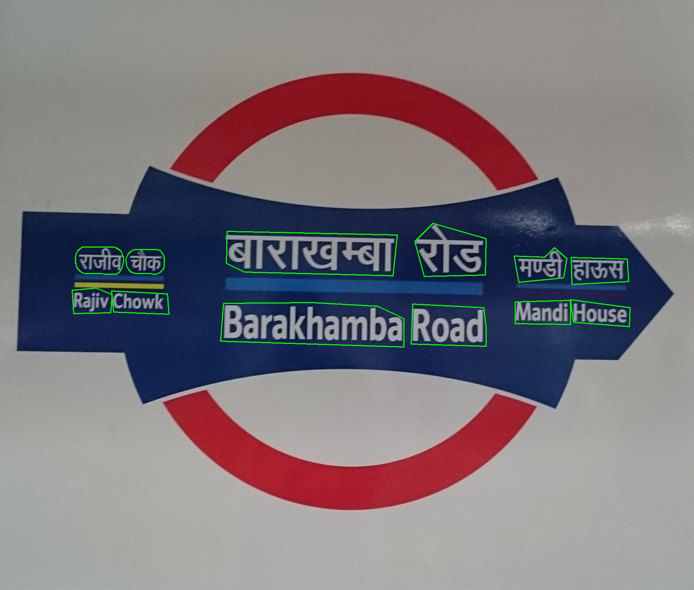
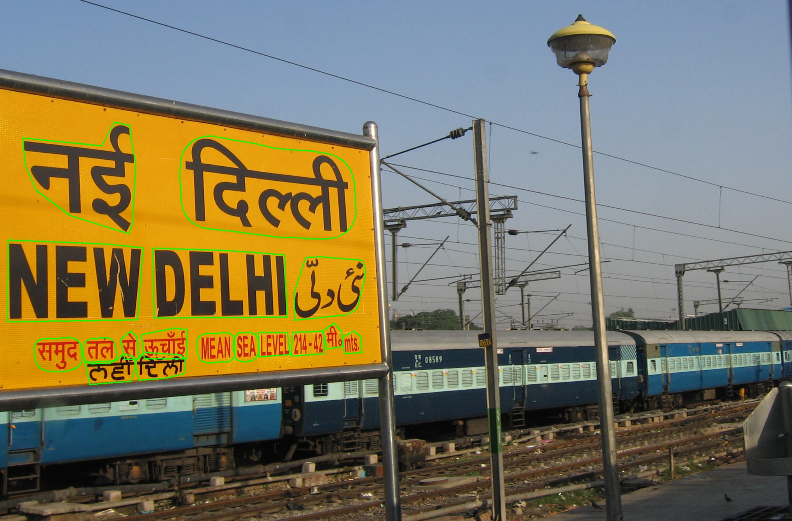

# Bharat Scene Text Dataset

[comment]: <> (Add a table with 13 languages and links to its files)

# Release updates:

[comment]: <> (checkbox style release updates with cross ticks for the ones present)

- [2/2/24] Data v1 released for 13 languages along with the detection annotations.

### UpNext
- [ ] Recognition annotation release.
- [x] Detection annotations for 13 languages.
- [x] Data v1 for 13 languages.

# Data Description:
## Data Statistics:

| Language | #images | #Total words | # Total words with recognition annotations |
| :---: | :---: | :---: | :---: |
| Assamese | 295 | 7996 | 0 |
| Bengali | 305 | 9766 | 0 |
| Gujarati | 525 | 4777 | 4062 |
| Hindi | 1218 | 17945 | 17088 |
| Kannada | 627 | 8898 | 6606 |
| Malayalam | 474 | 6850 | 0 |
| Meitei | 82 | 1633 | 0 |
| Odia | 533 | 10660 | 0 |
| Punjabi | 517 | 20028 | 19261 |
| Tamil | 521 | 5413 | 4505 |
| Telugu | 607 | 6377 | 0 |
| Urdu | 551 | 11773 | 0 |
| Marathi | - | 25875 | 0 |


## Data Download:

Step 1: Request access to the data by filling this [form](https://forms.gle/pbJAQpSSKB8jGhTcA). We shall review your request and provide access to the data.

Step 2: Download the data from the link provided in the email.

Step 3: Extract the downloaded zip file into "data" folder
```
unzip BSTD.zip -d data
```
Step 4: Download the images
```
python3 downloadImages.py 
```

## Data Format:
Words in the image are annotated in the polygon format. The annotation file is a json file with the following format:
```
"language_image_id": {
    "annotations": 
    {
        "polygon_0":
        {
            "coordinates":
                [
                    [x1, y1],
                    [x2, y2],
                    ...,
                    [xn, yn]
                ],
            "text": "text in the current polygon"
        },
        ...,
        "polygon_n":
        {
            "coordinates":
                [
                    [x1, y1],
                    [x2, y2],
                    ...,
                    [xn, yn]
                ],
            "text": "text in the current polygon"
        }
    },
    "url": "url of the image",
    "image_name": "name of the image",
    "language": "main language"
}
```

## Data Visualisation:
To visualise detection annotations, run the following command:
```
python3 visualise.py <image_path> <path_to_BSTD.json>
```
for e.g.
```
python3 visualise.py data/hindi/image_141.jpg data/BSTD.json
```

Some examples are below:
<!-- Add an example image next to this line -->



## Known Issues:
- The data is collected from the internet and hence there are some images which are not in the correct orientation. We have tried to remove such images but there might be some left. 

## Data Annotation
- All the images are collected from Wikimedia commons (under Creative Commons Licence, cc-by-sa-4.0)
- Further detection and recognition annotations are human annotated.

# Contact
For any queries, please contact us at:
- [Anand Mishra](mailto:mishra@iitj.ac.in)
- [Abhirama Subramanyam](mailto:penamakuri.1@iitj.ac.in)
